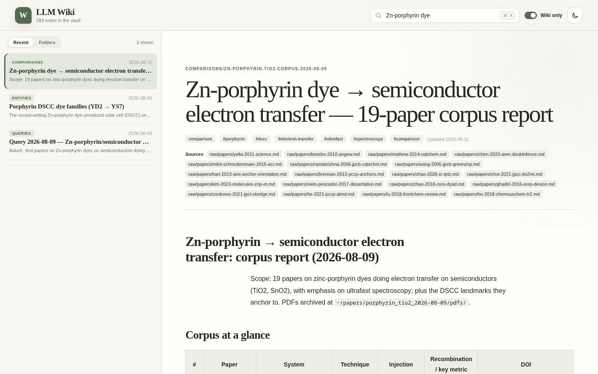
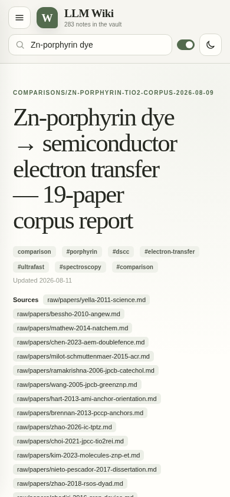

# LLM Wiki Viewer

Read-only web viewer for the [llm-wiki](https://gist.github.com/karpathy/442a6bf555914893e9891c11519de94f)
layer inside an Obsidian vault. Vue 3 + Vite frontend, Fastify backend, single
Docker container.

- Lists every markdown note in the vault (title, type, tags, excerpt, updated)
- Toggle "llm_wiki only" to show just the wiki-managed layers:
  `entities/`, `concepts/`, `comparisons/`, `queries/`, `raw/`
- Full markdown rendering with working `[[wikilinks]]` navigation, client-side search
- Vault is mounted read-only; the app never writes

## Screenshots

### Desktop



### Mobile



## Run

```bash
docker run -d \
  --name llm-wiki-viewer \
  --restart unless-stopped \
  -p 12123:8080 \
  -v /absolute/path/to/your/obsidian-vault:/data/vault:ro \
  ghcr.io/alchemist-aloha/llm-wiki-viewer:latest
```

Replace the vault path with the absolute path to your Obsidian vault, then open
<http://localhost:12123> in your browser. Change the first port in
`-p 12123:8080` to use a different host port.

## API

- `GET /api/pages` — list with frontmatter + excerpt (cached 30s)
- `GET /api/page/<slug>` — full markdown + frontmatter, e.g. `/api/page/concepts/electron-transfer`

## Dev

```bash
npm install
npm run dev       # Vite dev server on :5173 (API proxying: run server separately)
npm run build     # production frontend build -> dist/
docker compose up -d --build  # build and run the image from source
```
